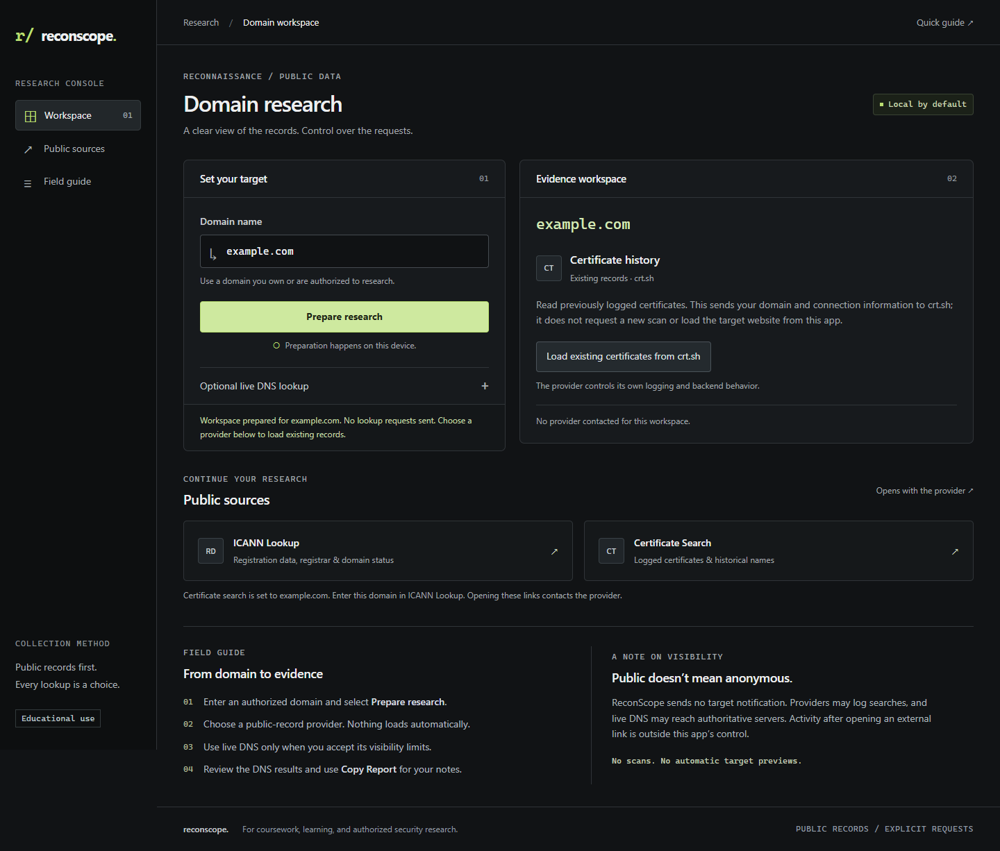

# ReconScope

A static, responsive public-records research dashboard, built for coursework and authorized security research. No installation, backend, API key, or build process is required. **Preparing a research workspace is local and sends no lookup requests.**

## What It Does

ReconScope prepares a local workspace for a domain, then lets you explicitly load existing Certificate Transparency records from crt.sh or open public lookup links. It does not automatically visit the target website, submit scans, or run DNS lookups.

Optional live DNS collects A (IPv4), AAAA (IPv6), MX (mail exchange), NS (nameserver), TXT (text), and CNAME (alias) records through Google Public DNS. Each card shows record values and TTLs in seconds. A checkbox must be enabled for each run because recursive DNS can cause requests to authoritative servers.

## Visibility and Privacy

- **Default preparation:** domain validation and link creation happen locally. No provider is contacted by this action.
- **Load existing certificates:** explicitly contacts crt.sh with the domain. It reads existing log records; the app does not request a scan or fetch the target. Provider logging and backend behavior are outside the app's control.
- **Live DNS:** Google sees the request and your connection IP; uncached lookups may reach the target's authoritative DNS servers, whose operator may log them. The choice resets after each valid run and on page restoration.
- **External links:** clicking contacts the provider. Onward navigation and actions in another tab are outside ReconScope's control.
- There is no target notification feature, but **no guarantee of anonymity, invisibility, or lack of provider-side observation**.
- App-initiated fetches are restricted by Content Security Policy to Google DNS and crt.sh. Redirects are rejected. Remote images, frames, target favicons, automatic enrichment, scan submission, analytics, and DNS fallback from certificate failures are absent.
- No query history or cookies are written by the app. Hosting operators, browsers/extensions, and external providers have their own behavior. The app's CSP does not control another tab or the providers' servers.

References: [Google DNS privacy](https://developers.google.com/speed/public-dns/privacy), [Certificate Transparency](https://certificate.transparency.dev/).

## Features

- Local-by-default workspace preparation
- Explicit existing-certificate lookup with a 15-second timeout, 2 MiB response limit, and at most 100 displayed entries
- Per-run opt-in for live DNS; no automatic retries or fallback to live checking
- Domain validation and normalization of HTTP/HTTPS prefixes, trailing slashes, and letter case
- Public DNS lookup for A, AAAA, MX, NS, TXT, and CNAME records
- Independent requests, a 12-second timeout per request, and clear partial-failure states
- Lookup timing and total displayed record count
- Copy report with clipboard fallback and readable failure messages
- ICANN lookup and domain-specific certificate transparency lookup
- Responsive interface, keyboard focus indicators, semantic labels, and live status messages
- No application query history, cookies, analytics, or external fonts

## Design and Verification

The interface uses a compact sidebar, a target/evidence workbench, graphite surfaces, restrained green accents, and locally available fonts. On mobile, the workspace becomes a single column.

Browser checks for this revision confirmed zero lookup requests on page load, typing, invalid input, and default preparation; an explicit certificate action contacted only crt.sh. Fixtures covered duplicate certificates, untrusted record text, unavailable/rate-limited/redirected/oversized/malformed responses, and no live-DNS fallback. Live DNS passed for example.com, google.com, and github.com with accurate counts and per-run opt-in reset. Native clipboard copying and direct-file operation passed. Layouts were checked at 320, 390, 768, 1024, and 1440 pixels.

A live crt.sh browser request initially failed with a readable bounded error; a subsequent isolated check returned 39 distinct matching entries. Availability is provider-dependent. These checks establish app behavior, not what providers do internally or an anonymity guarantee.

## How It Works

1. The user enters a domain; JavaScript validates and normalizes it locally.
2. **Prepare research** displays a workspace without lookup requests.
3. **Load existing certificates from crt.sh** sends one explicit JSON request to that provider. Names, issuers, certificate validity windows, and log dates are displayed as text. These do not prove current certificate deployment or complete coverage.
4. If the user explicitly enables live DNS and selects **Run DNS lookup**, the browser queries `https://dns.google/resolve` separately for each record type.
5. DNS results return as JSON; `Promise.allSettled()` organizes successful and failed requests independently.
6. The DNS interface displays records, counts, TTLs, and elapsed time measured with `performance.now()`. The live-DNS choice then returns to off.

Records are filtered by DNS type and deduplicated within each card. An A or AAAA answer can include an alias chain; those CNAME entries are not counted as addresses. The total is the sum of records displayed in all six cards, not all answer entries returned by the API. Failed requests remain distinct from successful requests with no records. NXDOMAIN means the resolver reports that the domain does not exist.

Google receives the requested domain and the connection's IP address. The application sends `edns_client_subnet=0.0.0.0/0` to request that Google not forward client subnet information to authoritative nameservers. It omits credentials and referrers and does not persist query history. External research sites are visited only when you open their links; their own privacy policies apply.

API reference: [Google DNS-over-HTTPS JSON API](https://developers.google.com/speed/public-dns/docs/doh/json).

## How to Install

No installation is required:

1. Download or clone the repository. If downloaded as a ZIP, extract it first.
2. Open the project folder.
3. Open `index.html` in a modern browser.
4. Enter a domain.
5. Select **Prepare research**, then choose a public-record provider if desired.

Alternatively, clone your published repository:

```bash
git clone https://github.com/YOUR-USERNAME/recon-webapp.git
cd recon-webapp
```

Replace `YOUR-USERNAME` with your GitHub username. Open `index.html` after cloning. Internet access is required for live lookups. If local-file requests or clipboard access are restricted by your browser, use the HTTPS GitHub Pages version. No Node.js, npm, Python, database, or server is needed to use or deploy the app.

## Step-by-Step Instructions

1. Choose a domain you own, control, or have permission to research.
2. Type the domain into **Target domain**, for example `example.com`. `https://EXAMPLE.com/` is normalized to `example.com`. Subdomains such as `mail.example.com` are accepted.
3. Select **Prepare research** or press Enter. No lookup requests are sent in the default mode.
4. To read existing certificates, select **Load existing certificates from crt.sh**. This contacts crt.sh. Failure leaves a readable message and never triggers DNS, a scan, or an automatic retry. Large responses can be researched through the external Certificate Search link.
5. To avoid resolver-to-authority traffic, leave **Optional live DNS lookup** off. If you need live DNS, expand it, read the visibility explanation, check **Allow live DNS for this run**, and select **Run DNS lookup**. The form remains disabled while requests finish or time out. Permission does not carry over to another run.
6. After a DNS run, review the target, count, timer, and A/AAAA/MX/NS/TXT/CNAME cards. TTL is the resolver-reported cache lifetime in seconds. Empty and failed lookups are distinguished. To retry DNS, explicitly enable it again.
7. Open **ICANN Lookup** and enter the displayed target on that site, or use **Certificate Search** for the prepared target. Both links open in a new tab; read the provider's controls before starting any action there.
8. After a DNS lookup, select **Copy Report** and paste into notes. The report includes the live-DNS visibility limitation. Copying is not currently provided for certificate entries. Clipboard errors are shown clearly.

Only domain names are accepted: paths, query strings, ports, credentials, raw IP addresses, `localhost`, and malformed names are rejected. Internationalized names must use ASCII/Punycode form (for example an `xn--` label).

## Project Structure

```text
recon-webapp/
├── index.html
├── style.css
├── script.js
├── README.md
├── .gitignore
└── screenshots/
    ├── .gitkeep
    └── reconscope.png
```

## Technologies Used

- HTML5
- CSS3
- Vanilla JavaScript
- Google DNS-over-HTTPS

## GitHub Pages Deployment

### Upload the project to GitHub

1. Sign in to GitHub and select **New repository** from the **+** menu.
2. Name it `recon-webapp`, select **Public**, and create the repository. Leave the generated README, license, and `.gitignore` options unchecked because this folder already contains the project files.
3. On the empty repository page, select **uploading an existing file**. For an existing repository, use **Add file → Upload files**.
4. Upload the **contents** of `recon-webapp`, including `index.html`, `style.css`, `script.js`, `README.md`, `.gitignore`, and the `screenshots` folder. Ensure `index.html` appears at the repository root, not inside another `recon-webapp` folder. Show hidden files in your file manager to include `.gitignore` and `.gitkeep`.
5. Enter a commit message such as `Add ReconScope dashboard` and select **Commit changes** on the `main` branch.

If you prefer Git, create an empty GitHub repository first, open a terminal in this project folder, then run:

```bash
git init
git add .
git commit -m "Add ReconScope dashboard"
git branch -M main
git remote add origin https://github.com/YOUR-USERNAME/recon-webapp.git
git push -u origin main
```

Replace `YOUR-USERNAME`. Git may prompt you to configure your author identity or sign in. Git is optional and is not required to run the application.

### Enable Pages

1. Upload the project to GitHub as described above.
2. Open the repository's **Settings**.
3. Open **Pages** under **Code and automation**.
4. Under **Build and deployment → Source**, choose **Deploy from a branch**.
5. Choose **main** as the branch.
6. Choose **/ (root)** as the folder.
7. Select **Save**.
8. Wait for the deployment to finish; check the repository's **Actions** tab if needed.
9. Open the generated GitHub Pages URL shown in **Settings → Pages**, normally `https://YOUR-USERNAME.github.io/recon-webapp/`.

The app uses relative CSS and JavaScript paths and requires no build configuration. Deployment has to be performed in your own GitHub account; the provided folder is ready to upload.

Reference: [GitHub Pages publishing source](https://docs.github.com/en/pages/getting-started-with-github-pages/configuring-a-publishing-source-for-your-github-pages-site).

## Limitations

- This application does not perform active scanning, direct target HTTP requests, port scans, vulnerability testing, authentication attempts, exploitation, or subdomain enumeration.
- Certificate entries may contain historical subdomain names. The app does not generate candidate names, resolve those discovered names, or test whether they are live.
- crt.sh has variable availability and may block browser access or rate-limit requests. There is no promised exhaustive history or service-level guarantee. Records are deduplicated by displayed certificate identity; only the first 100 matching distinct entries in a bounded response are displayed, without a newest-first guarantee.
- It queries a public recursive resolver, which may contact authoritative DNS servers to resolve uncached names. It is not a historical passive-DNS database.
- Results depend on Google DNS availability, DNS configuration, caching, and network access. DNSSEC failures can produce failed cards.
- Empty results do not prove that a domain is unused or secure. An apex domain often has no CNAME.
- The six queries are independent and are not an atomic snapshot. Answers can change over time.
- Only the six listed record types are displayed, not authority/additional sections or every possible DNS type.
- Clipboard support depends on browser settings. The app tries the Clipboard API first, then a legacy copy fallback, and displays an error if both fail.
- The app stores no query history; this does not make requests anonymous to the resolver or external research sites.

## Ethical Use

Use ReconScope only with domains you own, control, or have permission to research.
The application is intended for coursework, learning, and authorized cybersecurity activity.

## Screenshot



The delivery includes a screenshot of the updated local-preparation workflow. Before submission, you can replace it with your own final screenshot at `screenshots/reconscope.png`. Keep that filename so this README preview continues to work.

## Target research shortcuts

Preparing a target fills ICANN Lookup, crt.sh, urlscan history, VirusTotal domain report and Wayback history links locally. These open externally; results are not automatically imported. ICANN may require the registered domain instead of a subdomain. Optional certificate loading on preparation is off by default and resets each run. Only this selected option contacts crt.sh automatically. No hosted deployment is used.

Existing reports can be incomplete or stale. Do not use scan/reanalysis/save actions if you intend to avoid target requests. Archive replay can load live resources. Provider accounts and quotas may apply.

Source documentation: https://lookup.icann.org/ · https://urlscan.io/docs/search/ · https://docs.virustotal.com/docs/searching · https://help.archive.org/help/using-the-wayback-machine/
